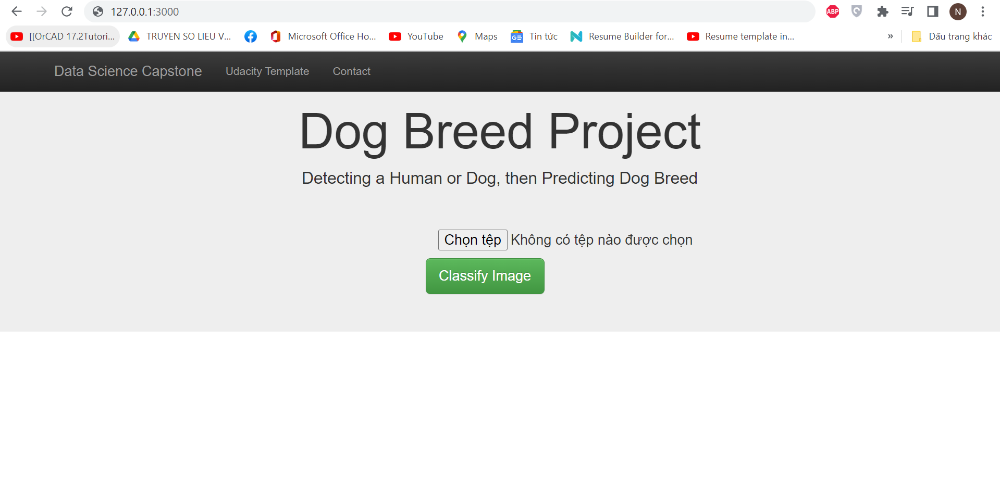
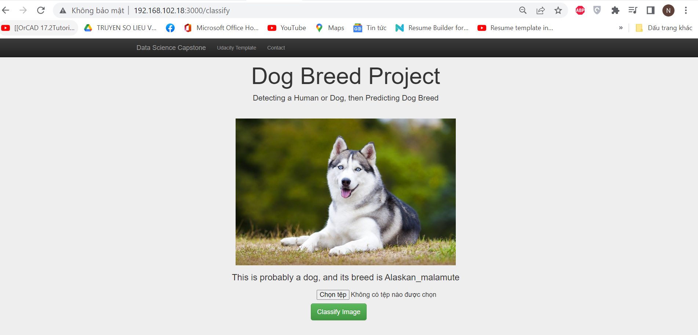
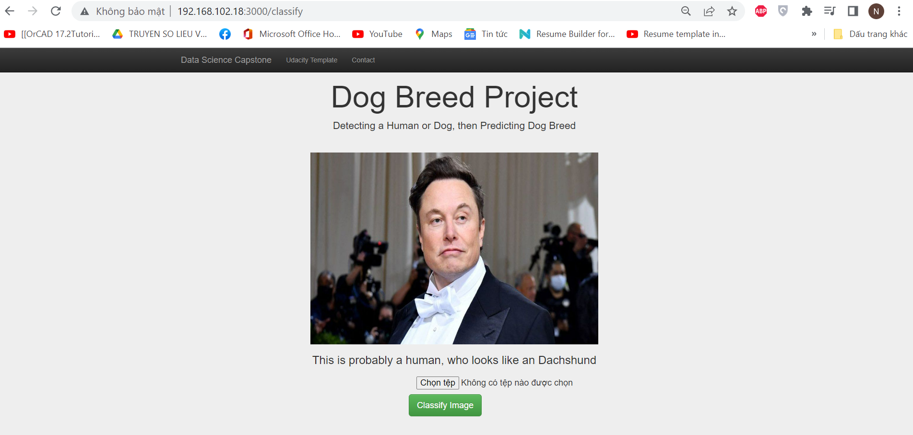
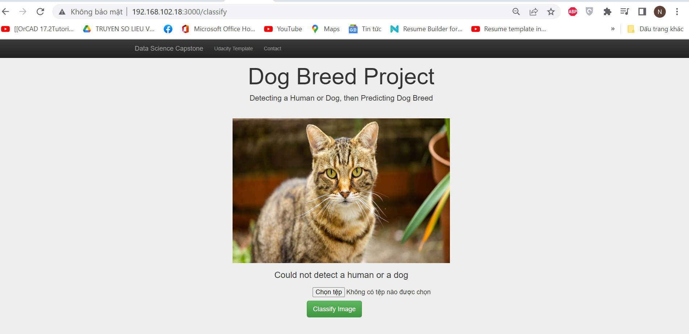

### Data Scientist Nanodegree
# Dog Breed Classification Project

### Table of Contents
1. [Installation](#installation)
2. [Project Motivation](#motivation)
3. [File Descriptions](#files)
4. [Introductions](#introductions)
5. [Licensing, Authors, Acknowledgements](#licensing)

The project report can be found in [Notebook Version](dog_app.ipynb) or [HTML Version](dog_app.html)

Note: If you want to try out the Notebook, please download some required data as well as install some additional libraries as instructed in it (I ran it in workplace of this course using Python 3.6.3 with libraries provided by Udacity).

## Installation 

The code is tested using Python version 3.6.3. All necessary libraries are in `requirements.txt` file, run the following commands in project's root directory to install them.

`pip install -r requirements.txt`

## Project Motivation 

In this project, I learned about Convolutional Neural Networks (CNNs) to classify images of dogs according to their breed. By completing project notebook, I found that the biggest problems we are facing are the dataset and the structure of model, so building a CNN model from scratch is not easy. Fortunately, we can resolve this problem by transfer learning. The accuracy of model from scratch I built is only 2.99%, while the accuracy of model using transfer learning is 82.0% (InceptionV3). What a considerable improvement. This project includes a web app where a user can upload a new image and get classification result. Here are the steps to build the dog breed classifier:
1. Build a face detector using [Haar feature-based cascade classifiers](https://docs.opencv.org/3.4/db/d28/tutorial_cascade_classifier.html) to find human faces in a image.
2. Build a dog detector using [ResNet-50](http://ethereon.github.io/netscope/#/gist/db945b393d40bfa26006) to detect dogs in images.
3. Build a dog breed algorithm using InceptionV3 CNN (transfer learning) to classify the dog breed.

## File Descriptions 
There are an available notebook [HERE](dog_app.ipynb) to showcase work related to this project Markdown cells were used to assist in walking through the thought process for individual steps.

`- app`

`| - static`

`| | - uploads # All image files will be uploaded here`

`| | | - *.jpg, *.png, *.jpeg`

`| - templates`

`| | - master.html  # main page of web app`

`| | - classify_result.html  # classification result page of web app`

`| - dog_breed_algo.py # detect, predict dog breed`

`| - dog_names.json # file containing list of dog labels`

`| - dump_json.py # used to dump list of dog names into json file`

`| face_detector.py # detect a human by face detector`

`| - run.py  # Flask file that runs app`

`- haarcascades`

`| - haarcascade_frontalface_alt.xml  # face detector model`

`- images`

`| *.jpg, *.png # images from workplace`

`- saved_models`

`| - weights.best.from_scratch.hdf5  # Neural Network model built from scratch`

`| - weights.best.InceptionV3.hdf5  # dog breed classification model`

`| - weights.best.VGG16.hdf5 # dog detector model`

`- .gitignore`

`- dog_app.html # Project Notebook (html version)`

`- dog_app.ipynb # Project Notebook`

`- extract_bottleneck_features.py # code including extract_InceptionV3() function`

`- requirements.txt  # all necessary python packages`

`- LICENSE.txt`

`- README.md`

## Instructions 

0. Run the following command in the app's directory to generate `dog_names.json` file if not exist.
	`python dump_json.py`

1. Run the following command in the app's directory to run your web app.
    `python run.py`

2. Go to http://127.0.0.1:3000/

3. After you entered the webpage, select any image you want to upload (human, dog, or whatever image), then click on the "Classify Image" and wait for the result.

4. The uploaded image will display with classification result, you can upload another image to classify dog breed.

## Licensing, Authors, Acknowledgements 
Thanks Udacity for providing the project notebook.
